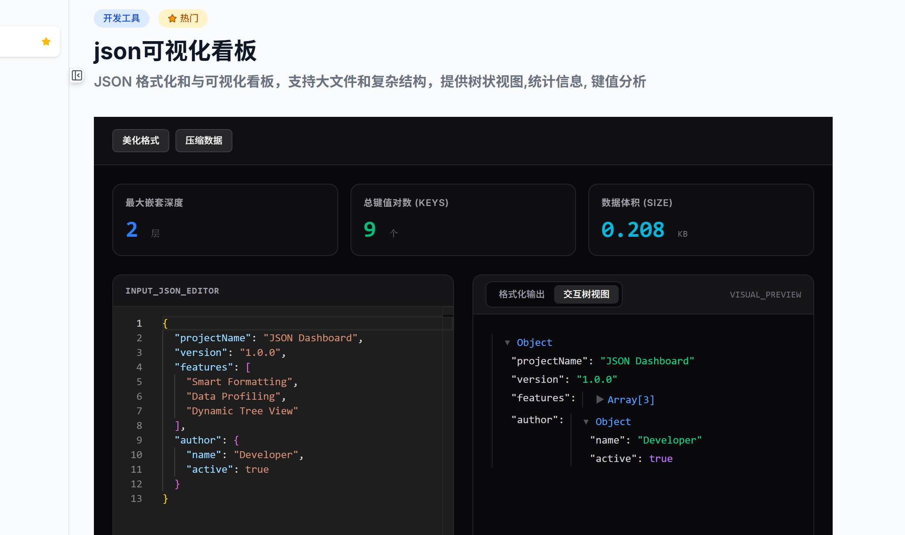

# tool666.cc 为开发者与职场人打造的“全能型”在线工具箱 🚀
🧰 tool666.cc：一个轻量、高效的在线工具箱，涵盖开发辅助、文本处理、图片转换等常用功能。  An elegant and lightweight online toolbox featuring development utils, text processing, image conversion, and more.
 

> **💡 告别电脑里零散的独立软件，一个网址，秒开即用。**
> `tool666.cc` 是一款专为高效工作与便利生活而生的在线工具集合站点。它完美集成了**开发辅助、图片处理、办公转换、创意文案、生活实用、效率工具**等高频需求，旨在为全栈工程师、独立开发者、职场办公人群及生活达人提供最纯粹的生产力支持。

🌐 **官方网站**：[https://www.tool666.cc](https://www.tool666.cc)

---

<!-- 💡 站点主页预览图片占位符 -->
## 🖥️ 站点预览

*（图一：简洁、清净、无广告的极简响应式主页）*

---

## ✨ 核心特性

- **⚡ 零延迟，秒开即用**：基于纯前端/高效轻量化架构，打开网页即可直接使用，无需忍受安装包的臃肿。
- **🙅‍♂️ 零干扰，纯净无暇**：**无需注册、无需登录、完全免费、没有任何弹窗广告**，还你一个绝对清净的工作台。
- **🔒 安全隐私，本地运行**：大部分高频数据处理（如 JSON 格式化、文本编解码、正则测试等）均在浏览器本地完成，数据不上传服务器，全方位保障核心代码与敏感数据的安全。
- **📱 响应式设计**：完美适配 PC 端与移动端浏览器，无论是写代码还是移动办公，都能随时随地提供支持。

---

## 🛠️ 功能模块一览

### 1. 💻 开发与加密辅助 (Developer Tools)
* **JSON 工具**：支持 JSON 格式化、压缩、验证、美化及一键复制，让混乱的数据结构一目了然[cite: 2]。
* **正则测试器**：提供实时的正则表达式匹配与测试，支持高亮显示，快速验证你的匹配规则[cite: 2]。
* **时间戳转换**：支持 Unix 时间戳（秒/毫秒）与北京时间（Y-m-d H:i:s）的双向快捷互转[cite: 2]。
* **文本编解码**：集成 Base64、URL 编解码、MD5/SHA 加密、Hex 转换等多种高频安全工具[cite: 2]。

<!-- 💡 开发者工具截图占位符 -->
---

*（图二：高频使用的 JSON 格式化）*
---

### 2. 🖼️ 多媒体与图形处理 (Graphics & Image)
* **智能图片压缩**：在保证画质的前提下，大幅压缩 PNG/JPG/WebP 体积，告别大图上传烦恼[cite: 2]。
* **二维码生成器**：支持自定义文本、链接生成二维码，提供一键下载，操作顺滑[cite: 2]。
* **格式互转**：支持常见图片格式（如 WebP、PNG、JPG、SVG）之间的快捷无损转换[cite: 2]。

### 3. 📄 办公转换与智能创作 (Office & Content Tools)
* **万能文案在线生成器**：营销软文、小红书种草、请假条、高情商回复、总结汇报一键生成。只需输入核心关键词，即可秒出爆款文案，拯救职场文字焦虑。
* **PDF 转换套件**：支持 PDF 转 Word、Word 转 PDF、PDF 拆分与合并等日常办公刚需[cite: 2]。
* **OCR 图片转文字**：高效识别图片中的文本内容，告别手动打字，一键提取[cite: 2]。
* **在线 Markdown 编辑器**：支持实时预览、实时渲染，是你撰写文档、技术博客的极简画布[cite: 2]。
* **文本处理工具**：包含大小写转换、去重、行排序、字数统计、差异对比（Diff）等基础文本清洗功能[cite: 2]。

<!-- 💡 智能创作工具截图占位符 -->
---

*（图三：万能文案生成器）*
---

### 4. ⏱️ 职场效率与白噪音 (Productivity & Focus)
* **番茄钟 (Pomodoro)**：内置“25分钟专注工作 + 5分钟带薪发呆”的高效循环番茄时间管理，帮你拉满日常代码编写或文档产出的效率[cite: 2]。
* **睡眠助眠音 (白噪音)**：内置雨声、篝火、潮汐、森林、咖啡馆等多款高品质疗愈白噪音。支持自由混音，无论是深夜助眠，还是日间办公深度专注，都能为你隔绝外界喧嚣。

### 5. 💡 生活实用与趣味工具 (Life & Everyday Tools)
* **今日油价查询**：实时同步全国各省市最新油价走势，92号、95号、98号汽油及柴油价格一目了然，方便车主把握最佳加油时机。
* **亲戚关系称呼计算器**：每逢过年过节的“大型认亲现场”必备！支持像计算器一样叠加输入关系（如：爸爸的哥哥的儿子的女儿），一键秒出准确称呼[cite: 2]。
* **大小写金额转换（大写人民币）**：报销、签合同、财务开票时的刚需。支持将数字一键转换为标准的中文字幕大写金额（如：壹仟贰佰叁拾肆元整），杜绝人工书写错误[cite: 2]。
* **个税/房贷计算器**：提供个税预估及商业贷款/公积金贷款等组合还款方案的极简试算，让个人资产规划一目了然[cite: 2]。
* **标准 BMI 计算器**：输入身高与体重，快速评估身体质量指数，附带健康区间范围参考[cite: 2]。
* **随机数/决定生成器**：支持自定义范围的随机数字抽取，以及“今天吃什么”等趣味选择题，专治各种职场与生活中的“选择困难症”[cite: 2]。

### 6. 🎨 人文教育与创意生成 (Culture & Education)
* **汉字笔顺和拼音查询**：专为辅导娃功课或汉字爱好者设计。支持动态演示汉字的标准笔画顺序，并提供精准的拼音、声调、部首及释义，一扫生僻字盲区。
* **诗意名字生成器**：融合《诗经》、《楚辞》、唐诗、宋词等古典文学精髓。只需指定姓氏或寓意倾向，即可批量生成古风雅致、寓意深远、不落俗套的诗意名字（适合宝宝起名、笔名或网名）。

<!-- 💡 生活与教育工具工具截图占位符 -->
---

*（图四：白噪音混音界面、油价查询及汉字笔顺动态演示）*

*（图五：油价查询及汉字笔顺动态演示）*

*（图六：汉字笔顺动态演示）*
---

## 📅 使用场景

* **全栈工程师 / 独立开发者**：写代码时需要快速格式化 JSON、测试正则、转换时间戳、排查 Base64 编码，无需打开庞大的 IDE 插件[cite: 2]。
* **新媒体运营 / 职场白领**：每天需要产出大量文案或周报，利用“万能文案生成器”快速寻找灵感；临时需要提取图片文字、压缩设计图，打开即用[cite: 2]。
* **精打细算的生活达人**：开车前顺手查查油价走势、过年走亲戚不知道怎么称呼、报销开票时卡在大写人民币转换，或者在买房/算个税时，都能用它快速完成测算[cite: 2]。
* **宝爸宝妈 / 传统文化爱好者**：用来辅导孩子正确的汉字笔顺，或者想翻阅古籍诗词给宝宝起一个惊艳又有寓意的好名字。
* **极简主义与高压人群**：不喜欢电脑 C 盘被各种软件塞满；深夜失眠或白天心浮气躁时，戴上耳机点开白噪音，快速进入深度睡眠或高效专注状态。

---

## 🤝 参与贡献与反馈

欢迎大家一起完善本项目的 GitHub 介绍页或向站长反馈意见：
1. **提交 Issue**：若你发现工具有失效、体验不佳的情况，或对新工具有迫切需求，欢迎提交 Issue[cite: 2]。
2. **贡献文档**：欢迎 Fork 本仓库并提交 Pull Request，帮助补充更详细的工具使用技巧或场景[cite: 2]。

---

## 📝 许可证

本项目说明文档基于 **[MIT License](LICENSE)** 协议开源[cite: 2]。

---

> 🚀 **如果你觉得 tool666.cc 确实帮到了你，不妨将它加入浏览器收藏夹，或者将这个 GitHub 仓库分享给身边的朋友们！**[cite: 2]